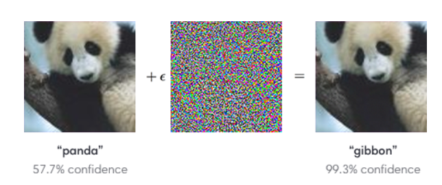
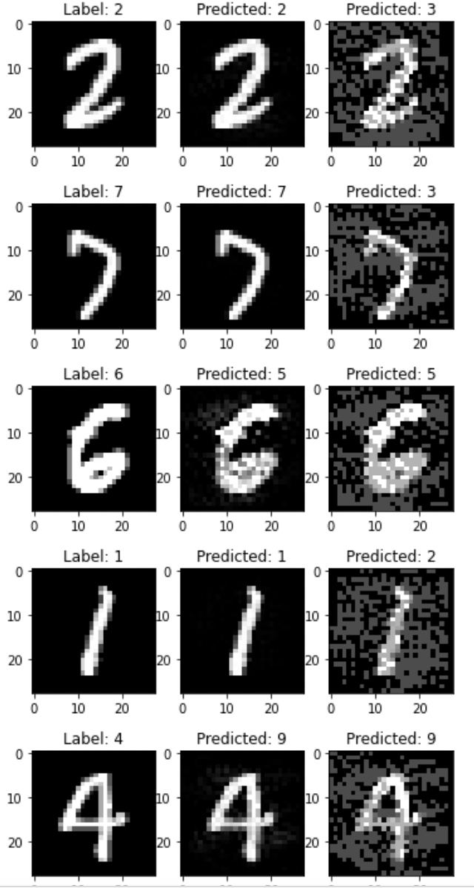
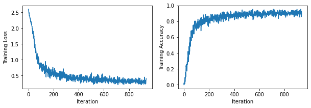
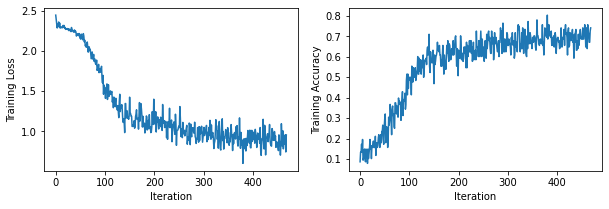

A machine learning model is robust if certain criteria are met. For example, a model is robust if for an image of a cat it predicts that it is indeed a cat, but also if we add a small amount of noise in the same input image, then the model should still deliver the same prediction.


**Creating Adversarial Examples** 

First we have to find a way to create an adversarial example. An adversarial example is an input of the neural network that results in an incorrect prediction. We are going to use two different bounded attacks:

1. L_2 bounded attacks:

First, we have to craft adversarial pertrubations that have a L_2 norm of ||x_pertr - x|| = epsilon, with epsilon being a given radius(here epsilon = 5).

2. L_infinity bounded attacks

Following, we craft adversarial pertrubations with L_infinity norm of ||x_pertr - x|| < epsilon (here epsilon = 0.3)

We implemented a fast gradient attack and trained our model. 

Visualization of the created adversarial examples and the prediction of our model on them:



The prertrubet accuracy with the L_2 bounded attack is: **9,7%**

and

The prertrubet accuracy with the L_infinity bounded attack is: **2,7%**

**Adversarial Training**

Now, our goal is to perform adversarial training on our CNN model. This means that we are going to train our model based on the prediction that it does on the pertrubed images. We are going to use only the L_2 bounded attack for our training.

Results:




Accuracy of the model without considering the attacks: **96,53%**


Accuracy of the model with the attacks: **94,59%**


  
**Certified Adversarial Robustness via Randomized Smoothing** 

Here, we want to train a smooth classifier via the principle of randomized smoothing.  Randomized smoothing is a method for constructing a new, “smoothed” classifier from an arbitrary base classifier. (for more details see https://arxiv.org/pdf/1902.02918.pdf)
  



**Final Comparison**

Here, we are comparing the robustness of the different training types that we used (normal training, adversarial training and randomized smoothing training) and the results are the following:

```normal  training: correct_certified 974, avg. certifiable radius: 2.0746```

```adversarial training: correct_certified 1870, avg. certifiable radius: 0.8292```

```randomized smoothing training: correct_certified 7684, avg. certifiable radius: 0.9430```

We conclude that the robust training via randomized smoothing leads to the best robustness of the model.


**PyTorch** was used for the development of the model.
